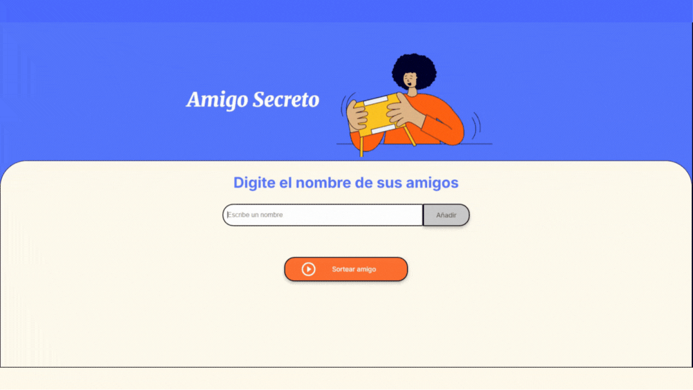

## 🎉 Amigo Secreto 🎉
¡Bienvenido al Sorteador de Amigos Secretos! 
Este proyecto desarrollado con Alura Latam, permite agregar nombres a una lista y seleccionar aleatoriamente un ganador.  

## 📝 Cómo funciona 
⛠Podes ingresar nombres en el campo de texto y agregarlos presionando Enter o haciendo clic en el botón "Añadir".  
⛠Para realizar el sorteo, deben haber al menos dos nombres en la lista. Si intentas sortear con solo un nombre, aparecerá un mensaje indicando que debes agregar más participantes.  
⛠Si intentas sortear sin ingresar ningún nombre, recibirás una advertencia para que agregues al menos dos.  
⛠Cada nombre agregado aparecerá en una lista con un botón "✘" al lado, que permite eliminarlo si es necesario.  
⛠Al realizar el sorteo, el nombre del ganador se mostrará con un efecto dinámico de parpadeo, destacando al afortunado 🊠  

## 🛠 Tecnologías utilizadas   
➛ JavaScript: Implementación de la lógica para agregar nombres, validar la lista, eliminar participantes y realizar el sorteo.  
⛠CSS (personalizado): Se realizaron ajustes en los estilos, como el tamaño y apariencia de los botones, el efecto de parpadeo en el nombre del ganador y la personalización de la interfaz.  
⛠HTML y CSS: Proporcionados por Alura Latam para la estructura y el diseño.   

https://rebeca-ferrel.github.io/Challenge-amigosecreto/
